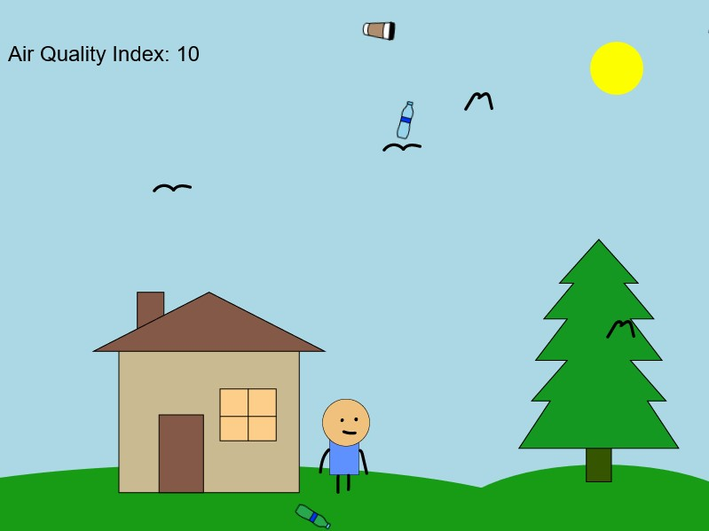
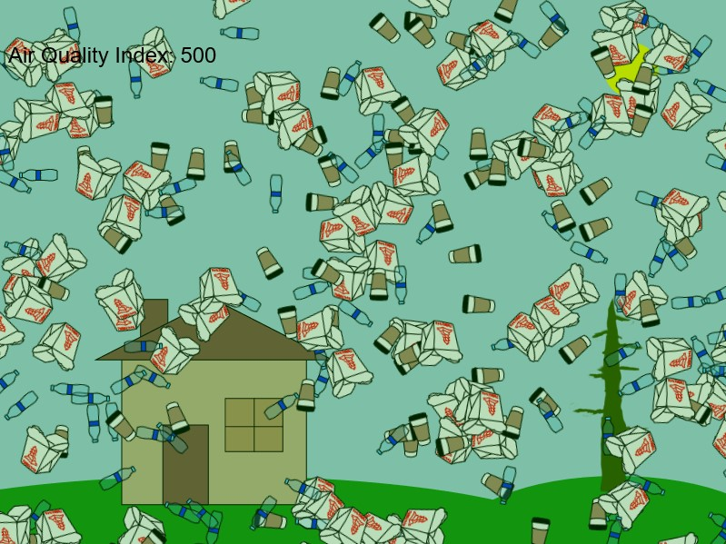

# The Atrium

A p5.js visualization of air pollution.
<https://kybouw.github.io/the-atrium/>

Copyright (c) Kyle Bouwman 2020-2021. All rights reserved.

## The Data

Climate change is a very prominent topic in the world right now. Global temperatures are rising at an alarming rate because of The Greenhouse Effect. Little particles of smog act as a blanket over the Earth’s surface, trapping the heat that comes from the Sun. These particles are invisible to the naked eye, but they pose a very significant threat.

The United States Environmental Protection Agency has created a metric for measuring the amount of pollution that is in the air. Data is collected all over the world, and is made available for free online thanks to the World Air Quality Index Project. Learn more at [waqi.info](https://waqi.info/).

### Legal

The data that this project uses is protected under the following terms:

- The data can not be sold or included in sold packages.
- The data can not be used in paid applications or services.
- The data can not be redistributed as cached or archived data.

(where *data* refers to the data obtained from the APIs)

## We Are the Sea Creatures

One night, my roommate and I were were talking about air currents and wind. He is a mechanical engineer specializing in fluids and thermodynamics, and he knew a lot about the way that air moves around because air is just like any other fluid.

I realized that if air is a fluid, just like water, then us humans are really swimming in an “ocean” of air. We are not very different from the little hermit crabs crawling around the ocean floor moving from shell to shell. If you could see the edge of the Earth’s atmosphere, then it would look a lot like the surface of the ocean.

## The Analogy

Much like we pollute our air, we also pollute our oceans. One key difference is that we can see some of the pollution that we put into the water (in the form of garbage), whereas we cannot always see the pollution we put into the air (unless it is a really hazy day).

This project tries to address the following questions:

- What if we could make air pollution more visible?
- Would we still feel comfortable going outside if there were plastics and other garbage floating around in our air?
- Would we begin to feel empathy for all of the sea creatures who are displaced because of the garbage that us humans create?

## Examples

### Low AQI - clean air

### High AQI - dirty air

